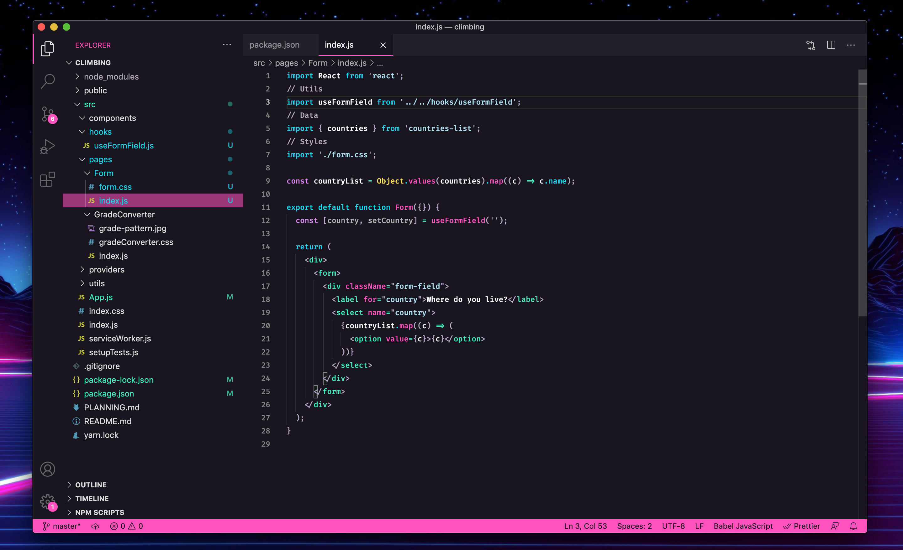

# LaserWave

An clean 80's synthwave / outrun inspired theme for Visual Studio Code.

### LaserWave

** **LaserWave Italic** -- now avaliable **

### LaserWave High Contrast (WCAG AAA)

**Currently supports:**

- Python
- Javascript
  - React
- Typescript
  - Angular
- Ruby
- Markdown
- Java
- C#
- Dart
- F#

If you find any missing highlighting or want a new language supported open an issue with an example file from the language 😀

## Color Scheme

| Color          | Hex     | High Contrast Hex | font-style  | scope |
| -------------- |:-------:|:-------:|:-----------:|:-----|
| Maximum Blue   | #40b4c4 | #1ed3ec | normal | Keywords, Properties |
| Hot Pink       | #eb64B9 | #ff52bf | normal | Functions, Attributes, Highlighting |
| Powder Blue    | #b4dce7 | #acdfef | normal | Strings |
| African Violet | #b381c5 | #d887f5 | normal | Numbers, Types |
| Pearl Aqua     | #74dfc4 | #3feabf | normal | Operators, Tags |
| Old Lavender   | #91889b | #b4abbe | normal | Comments |
| Roman Silver   | #7b6995 | #b4a8c8 | normal | Punctuation |
| Mustard        | #ffe261 | #ffe261 | normal | Builtins, Constants |
| White          | #ffffff | #ffffff | normal | Variables |
| Raisin Black   | #27212e | #19151e | --- | Background |

## Contributing to LaserWave

I am not the fastest responder, but I am try to get better at being active maintaining this 😁! If you would like to contribute to the project that is awesome. Please open an issue first with your suggestions or requests before putting in the work. For Pull Requests please include a description of all changes made and a screenshot of the changes 👍

### Supporters

- Bryan Phelps

### Contributors

A special shoutout to the contributors who have helped make LaserWave even better!

- @TGiles
- @cameronstinson4
- @lcatania
- @wbeeftink
- @hatched
- @axel-op
- @Deide
